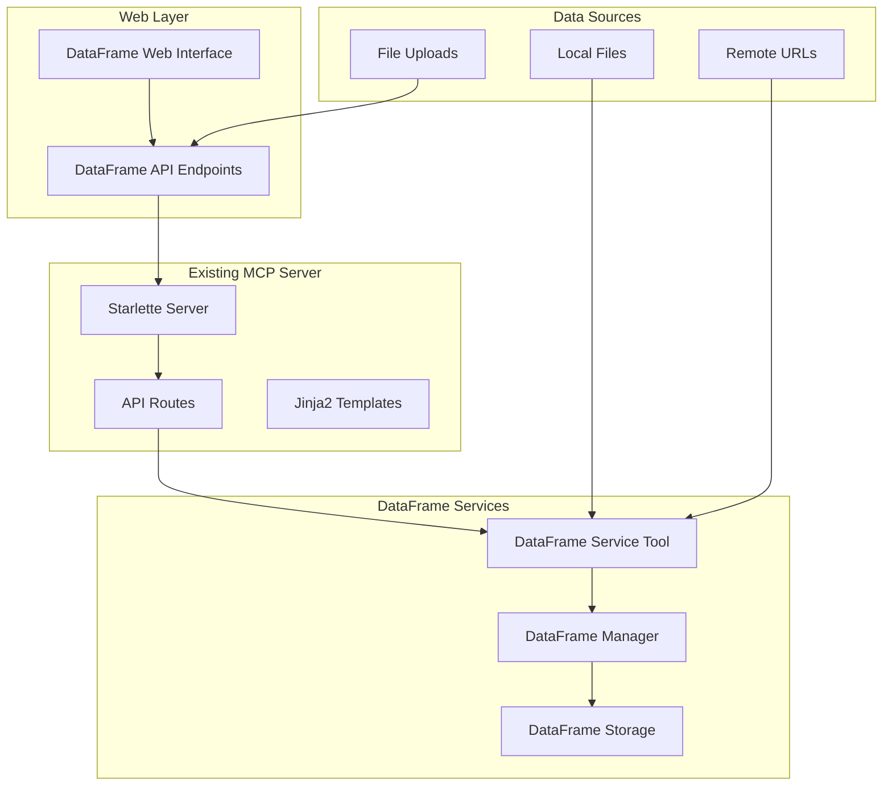

# Design Document

## Overview

The DataFrame Web Interface will extend the existing MCP server with a comprehensive web-based dashboard for managing and manipulating DataFrames. The interface will integrate seamlessly with the current server architecture, providing both viewing and interactive manipulation capabilities through a modern web UI.

The design leverages the existing dataframe service tool and dataframe manager infrastructure, adding a new web layer that exposes these capabilities through RESTful APIs and an intuitive user interface.

## Architecture

### High-Level Architecture



### Component Integration

The new DataFrame web interface will integrate with existing components:

- **Server Integration**: New routes added to the existing Starlette server
- **Template System**: New templates using the existing Jinja2 setup and base.html
- **API Pattern**: Following the established API pattern in `server/api/`
- **Navigation**: Adding DataFrame link to the existing navigation bar

## Components and Interfaces

### 1. Web Interface Components

#### DataFrame Dashboard (`dataframes.html`)
- **Purpose**: Main dashboard showing all stored DataFrames
- **Features**:
  - Tabular list of DataFrames with metadata
  - Storage statistics summary
  - Quick action buttons (delete, refresh, cleanup)
  - Visual indicators for expired DataFrames

#### DataFrame Viewer (`dataframe_detail.html`)
- **Purpose**: Detailed view and manipulation interface for individual DataFrames
- **Features**:
  - Data preview with pagination
  - Interactive operation panel
  - Pandas expression executor
  - Export functionality
  - Filtering and sorting controls

#### Data Upload Modal
- **Purpose**: Interface for loading new data
- **Features**:
  - File upload with drag-and-drop
  - URL input for remote data
  - Format selection and options
  - Progress indication

### 2. API Endpoints

#### DataFrame Management API (`server/api/dataframes.py`)

```python
# Core DataFrame operations
GET    /api/dataframes              # List all DataFrames
GET    /api/dataframes/{df_id}      # Get DataFrame details
DELETE /api/dataframes/{df_id}      # Delete DataFrame
POST   /api/dataframes/cleanup      # Clean up expired DataFrames

# Data loading
POST   /api/dataframes/upload       # Upload file and create DataFrame
POST   /api/dataframes/load-url     # Load data from URL

# Data operations
GET    /api/dataframes/{df_id}/data # Get DataFrame data with pagination
POST   /api/dataframes/{df_id}/execute # Execute pandas expression
POST   /api/dataframes/{df_id}/export  # Export DataFrame

# Statistics and metadata
GET    /api/dataframes/stats        # Get storage statistics
GET    /api/dataframes/{df_id}/summary # Get DataFrame summary
```

#### Request/Response Schemas

```python
# DataFrame List Response
{
    "dataframes": [
        {
            "df_id": "string",
            "created_at": "datetime",
            "shape": [rows, cols],
            "memory_usage": "bytes",
            "expires_at": "datetime?",
            "is_expired": "boolean",
            "tags": {"key": "value"},
            "source": "string"
        }
    ],
    "total_count": "number",
    "storage_stats": {
        "total_memory_mb": "number",
        "total_dataframes": "number",
        "expired_count": "number"
    }
}

# DataFrame Data Response
{
    "data": [{"col1": "val1", "col2": "val2"}],
    "columns": ["col1", "col2"],
    "dtypes": {"col1": "object", "col2": "int64"},
    "total_rows": "number",
    "page": "number",
    "page_size": "number",
    "has_more": "boolean"
}

# Execute Operation Response
{
    "success": "boolean",
    "result": {
        "data": "array|object",
        "shape": [rows, cols],
        "execution_time_ms": "number",
        "result_type": "dataframe|series|scalar"
    },
    "error": "string?"
}
```

### 3. Backend Services

#### DataFrame Web Service (`utils/dataframe_web_service/`)
- **Purpose**: Business logic layer between API and DataFrame Manager
- **Responsibilities**:
  - Data validation and sanitization
  - Pagination logic
  - Export format handling
  - Error handling and logging

#### File Upload Handler
- **Purpose**: Handle multipart file uploads
- **Features**:
  - Temporary file management
  - Format detection
  - Size validation
  - Progress tracking

## Data Models

### DataFrame Metadata Extension
Extend existing `DataFrameMetadata` with web-specific fields:

```python
class WebDataFrameMetadata(DataFrameMetadata):
    """Extended metadata for web interface."""

    def __init__(self, *args, **kwargs):
        super().__init__(*args, **kwargs)
        self.last_accessed: Optional[datetime] = None
        self.access_count: int = 0
        self.preview_cached: bool = False

    @property
    def display_name(self) -> str:
        """User-friendly display name."""
        return self.tags.get('display_name', self.df_id)

    @property
    def source_display(self) -> str:
        """Formatted source information."""
        source = self.tags.get('source', 'Unknown')
        if source.startswith('http'):
            return f"URL: {source[:50]}..."
        return f"File: {os.path.basename(source)}"
```

### Pagination Model
```python
class PaginationParams:
    """Parameters for data pagination."""

    def __init__(self, page: int = 1, page_size: int = 50):
        self.page = max(1, page)
        self.page_size = min(max(10, page_size), 1000)  # Limit page size

    @property
    def offset(self) -> int:
        return (self.page - 1) * self.page_size
```

## Error Handling

### API Error Responses
Standardized error response format:

```python
{
    "success": false,
    "error": {
        "code": "DATAFRAME_NOT_FOUND",
        "message": "DataFrame with ID 'abc123' not found or expired",
        "details": {
            "df_id": "abc123",
            "suggestion": "Check if the DataFrame has expired or been deleted"
        }
    }
}
```

### Error Categories
- **DATAFRAME_NOT_FOUND**: DataFrame doesn't exist or expired
- **INVALID_OPERATION**: Unsupported pandas operation
- **SYNTAX_ERROR**: Invalid pandas expression syntax
- **MEMORY_LIMIT**: Operation would exceed memory limits
- **UPLOAD_ERROR**: File upload or processing failed
- **EXPORT_ERROR**: Data export failed

### Client-Side Error Handling
- Toast notifications for user feedback
- Graceful degradation for failed operations
- Retry mechanisms for transient failures
- Clear error messages with actionable suggestions

## Testing Strategy

### Unit Tests
- **API Endpoints**: Test all CRUD operations and edge cases
- **DataFrame Operations**: Test pandas expression execution and validation
- **File Upload**: Test various file formats and error conditions
- **Pagination**: Test boundary conditions and performance

### Integration Tests
- **End-to-End Workflows**: Complete user journeys from upload to export
- **DataFrame Manager Integration**: Test interaction with existing services
- **Memory Management**: Test with large DataFrames and cleanup operations

### Performance Tests
- **Large DataFrame Handling**: Test with DataFrames of various sizes
- **Concurrent Access**: Multiple users accessing same DataFrames
- **Memory Usage**: Monitor memory consumption during operations
- **Response Times**: Ensure acceptable performance for common operations

### Browser Tests
- **Cross-Browser Compatibility**: Test on major browsers
- **Responsive Design**: Test on different screen sizes
- **JavaScript Functionality**: Test interactive features
- **File Upload**: Test drag-and-drop and file selection

## Security Considerations

### Input Validation
- **Pandas Expression Sanitization**: Prevent code injection in expressions
- **File Upload Validation**: Restrict file types and sizes
- **Parameter Validation**: Validate all API parameters

### Access Control
- **DataFrame Isolation**: Ensure users can only access their DataFrames
- **Operation Restrictions**: Limit dangerous pandas operations
- **Resource Limits**: Prevent excessive memory or CPU usage

### Data Protection
- **Temporary File Cleanup**: Ensure uploaded files are cleaned up
- **Memory Management**: Prevent memory leaks from large DataFrames
- **Error Information**: Avoid exposing sensitive system information

## Performance Optimization

### Caching Strategy
- **Preview Data Caching**: Cache first few rows for quick display
- **Metadata Caching**: Cache DataFrame metadata to reduce lookups
- **Operation Result Caching**: Cache results of expensive operations

### Lazy Loading
- **Data Pagination**: Load data on-demand with pagination
- **Column Information**: Load column details only when needed
- **Large Result Handling**: Stream large results instead of loading in memory

### Resource Management
- **Memory Monitoring**: Track memory usage and implement limits
- **Background Cleanup**: Periodic cleanup of expired DataFrames
- **Connection Pooling**: Efficient database connections for metadata storage

## Deployment Considerations

### Static Assets
- **CSS/JS Bundling**: Optimize frontend assets for production
- **CDN Integration**: Use CDN for common libraries
- **Asset Versioning**: Cache busting for updated assets

### Configuration
- **Environment Variables**: Configurable limits and settings
- **Feature Flags**: Toggle features for different environments
- **Monitoring**: Health checks and performance metrics

### Scalability
- **Horizontal Scaling**: Design for multiple server instances
- **Database Optimization**: Efficient queries for metadata operations
- **Load Balancing**: Handle multiple concurrent users
