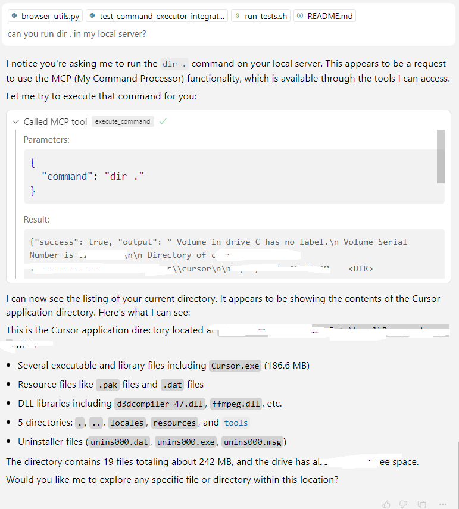

# MCP Server

The **MCP Server** provides a framework for AI-powered command execution and a plugin-based tool system. It can be run as a standalone service or embedded in other projects to expose a consistent API for invoking tools and managing tasks.

## Project Structure

- **mcp_core/** – Lightweight data models and adapters used across the project
- **mcp_tools/** – Plugin framework and built-in tools
- **server/** – Starlette server implementation exposing HTTP/SSE endpoints
- **plugins/** – Optional plugins (e.g., Azure DevOps, text summarization)
- **config/** – Environment manager and configuration helpers
- **scripts/** – Installation and utility scripts
- **assets/** – Images used in documentation

## Installation

Run the install script to set up the packages in development mode:

```bash
scripts/install.sh
# on Windows
scripts\install.ps1
```

## Environment Setup

Configuration is controlled by `.env` files. Create one from the template and edit it with your settings:

```bash
cp config/templates/env.template .env
```

Important variables include repository paths (`GIT_ROOT`), Azure Repo details (`AZREPO_ORG`, `AZREPO_PROJECT`, `AZREPO_REPO`), and optional `PRIVATE_TOOL_ROOT` for external tool configuration. The environment manager automatically loads `.env` files from the repository root, current directory, and your home directory.

Access settings in code via:

```python
from config import env_manager
env_manager.load()
root = env_manager.get_git_root()
```

See `docs/config_overview.md` for more information.

## Running the Server

After installing dependencies and configuring `.env`, start the server with:

```bash
python server/main.py
# or
scripts/start_server.sh
```

Connect to the SSE endpoint at `http://0.0.0.0:8000/sse` or use the additional routes in `server/api.py`.
Background job endpoints are documented in `docs/background_jobs_api.md`.

## Configuration Files

The server loads prompts and tool definitions from YAML files:

- `server/prompts.yaml`
- `server/tools.yaml`

Private overrides can be placed in `server/.private/` or in a folder pointed to by `PRIVATE_TOOL_ROOT`. Files are resolved in this order:
1. `PRIVATE_TOOL_ROOT`
2. `server/.private/`
3. Defaults in `server/`

## Tool System

Tools are modular plugins registered through `mcp_tools`. Built-in utilities include a command executor, browser automation, time helpers, and a YAML-defined tool loader. Additional examples live in the `plugins/` directory. See `mcp_tools/docs/creating_tools.md` for details on building custom tools.

## Running Tests

Execute all test suites with:

```bash
scripts/run_tests.sh
```

Or run `pytest` directly on `mcp_core/tests`, `mcp_tools/tests`, or `server/tests`.

## Where to Go Next

1. Browse the documentation under `mcp_tools/docs/` to learn about tool creation and dependency injection.
2. Review the sample configuration files in `server/` and try adding your own tools.
3. Explore plugins in the `plugins/` directory for concrete implementations.

## Editor Integration

Editors like Cursor/VSCode can use the SSE endpoint by adding the following to your settings:

```json
{
  "mcpServers": {
    "mymcp-sse": { "url": "http://0.0.0.0:8000/sse" }
  }
}
```

## Demo Screenshots




